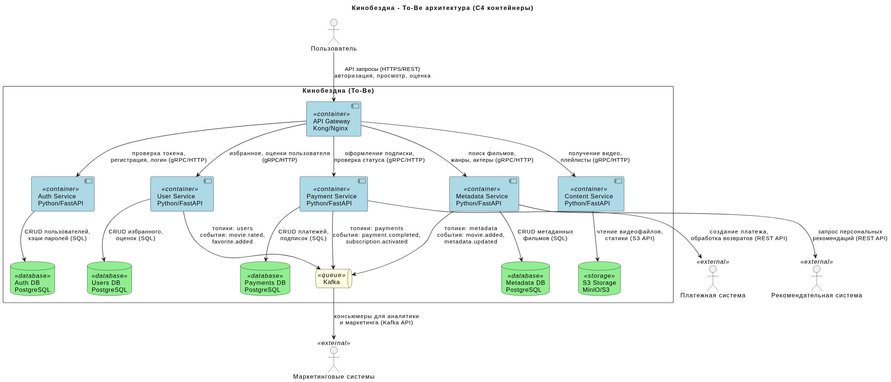
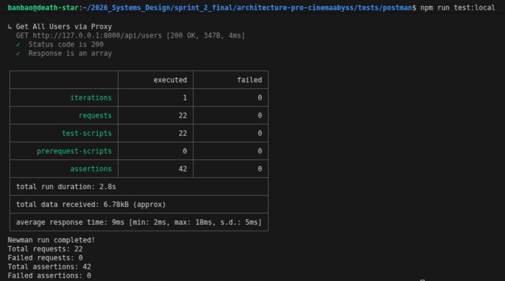
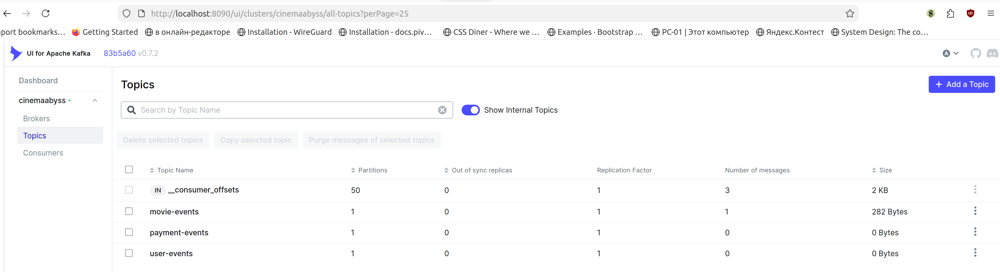
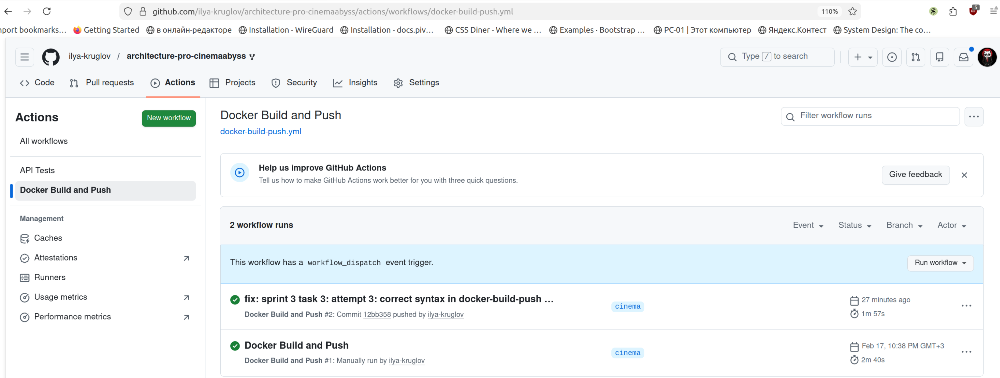
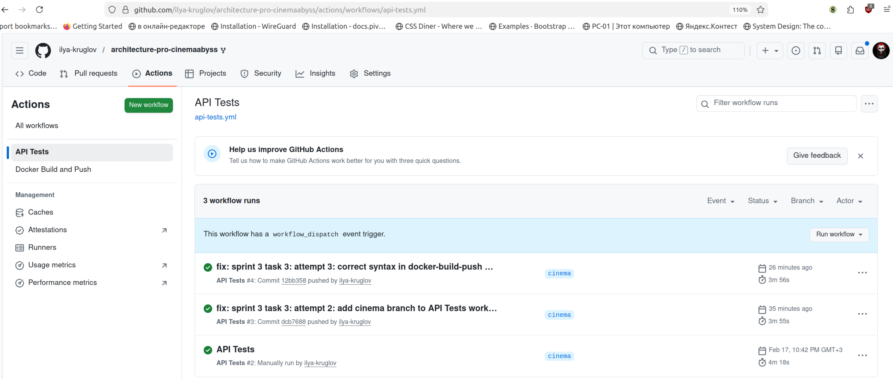
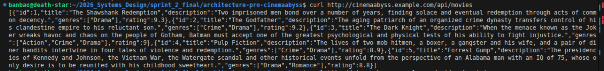
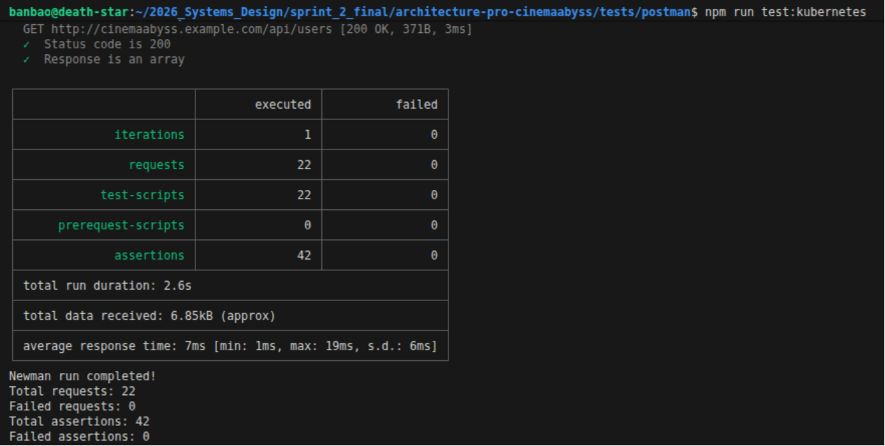
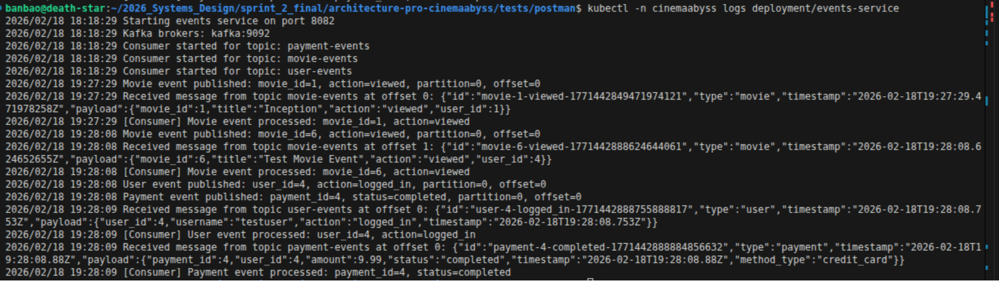
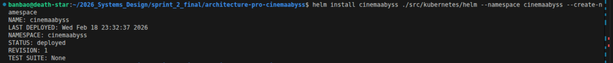
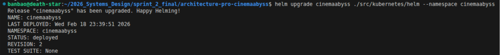

## Изучите [README.md](README.md) файл и структуру проекта.

## Задание 1

### Пояснения к архитектуре:

1. **Декомпозиция по доменам**
Монолит разделен на отдельные микросервисы, каждый отвечает за свой бизнес-домен:
    - **Auth Service:** Аутентификация и базовые профили.
    - **User Service:** Пользовательские данные (избранное, оценки).
    - **Payment Service:** Платежи и подписки.
    - **Metadata Service:** Сервис метаданных о фильмах `movies`.
    - **Content Service:** Видео-контент и работа с S3.
2. **Единая точка входа**
Внедрен **API Gateway**, который принимает все запросы от клиентов (Smart TV, мобильные приложения, веб), маршрутизирует их к соответствующим микросервисам, агрегирует данные при необходимости и применяет общие политики (аутентификация, rate limiting, логирование). Это решает проблему разнородных клиентов с разными потребностями в данных.
3. **Интеграционное взаимодействие**
    - **Синхронное**
    Для операций, требующих немедленного ответа (например, получение списка фильмов, аутентификация), используется синхронное взаимодействие через Gateway (HTTP/REST).
    - **Асинхронное**
    Для обеспечения слабой связанности, повышения надежности и возможности воспроизведения событий внедрена **Apache Kafka**. Сервисы публикуют события в топики, разделенные по доменам (`payments`, `users`, `metadata`). Kafka обеспечивает гарантированную доставку, хранение событий и возможность повторной обработки.
4. **Базы данных**
Каждый микросервис имеет собственную базу данных PostgreSQL.
5. **Внешние интеграции**
Взаимодействие с платежной системой и рекомендательным сервисом вынесено в соответствующие микросервисы. Интеграция с маркетинговыми системами происходит через Kafka Consumer.


[Ссылка на исходный код UML](diagrams/tobe-architecture.puml)


## Задание 2

### 1. Proxy
Команда КиноБездны уже выделила сервис метаданных о фильмах movies и вам необходимо реализовать бесшовный переход с применением паттерна Strangler Fig в части реализации прокси-сервиса (API Gateway), с помощью которого можно будет постепенно переключать траффик, используя фиче-флаг.

Реализован сервис на Go в `./src/microservices/proxy` с поддержкой:
- Проксирования запросов к монолиту (`/api/users`, `/api/payments`, `/api/subscriptions`).
- Проксирования запросов к movies-сервису с поддержкой процентного переключения трафика.
- Проксирования запросов к events-сервису (`/api/events/*`).
- Фиче-флага `GRADUAL_MIGRATION` и процентного распределения `MOVIES_MIGRATION_PERCENT`.

#### Инструкция по развертыванию/остановке
1. Сборка и запуск
`sudo docker compose up -d --build`
2. Остановка всех контейнеров
`sudo docker compose down -v`
3. Удаление старых образов
`sudo docker system prune -a`

#### Проверка конфигурации:
    curl http://localhost:8000/health | jq
##### Response:
```
{
  "config": {
    "gradual_migration": true,
    "movies_migration_percent": 50
  },
  "status": "healthy"
}
```
#### Проверка events
    curl http://localhost:8000/api/events/health | jq
##### Response:
```
{
  "kafka": "connected",
  "status": true,
  "topics": [
    "movie-events",
    "user-events",
    "payment-events"
  ]
}
```
#### Отправка тестового события
    curl -X POST http://localhost:8000/api/events/movie \
      -H "Content-Type: application/json" \
      -d '{"movie_id":1,"title":"Inception","action":"viewed","user_id":1}' \
      | jq

#### Проверка логов events-service
sudo docker compose logs events-service --tail 50
##### Response:
```
cinemaabyss-events-service  | 2026/02/17 18:20:53 Movie event published: movie_id=1, action=viewed, partition=0, offset=0
cinemaabyss-events-service  | 2026/02/17 18:20:53 Received message from topic movie-events at offset 0: {"id":"movie-1-viewed-1771352453083199870","type":"movie","timestamp":"2026-02-17T18:20:53.083202724Z","payload":{"movie_id":1,"title":"Inception","action":"viewed","user_id":1}}
cinemaabyss-events-service  | 2026/02/17 18:20:53 [Consumer] Movie event processed: movie_id=1, action=viewed
```
#### Тестирование API Gateway:
    curl http://localhost:8000/api/movies

### 2. Kafka
Реализован MVP сервис events на Go в ./src/microservices/events с поддержкой:

- Producer API для публикации событий в Kafka:
    - POST /api/events/movie - публикация в топик movie-events.
    - POST /api/events/user - публикация в топик user-events.
    - POST /api/events/payment - публикация в топик payment-events.
- Consumer, подписанный на все три топика, с логированием полученных сообщений.
- Интеграция с Kafka UI для мониторинга.

#### Запуск тестов
1. `cd architecture-pro-cinemaabyss/tests/postman`
2. `npm install`
3. `npm run test:local`

#### Скриншот тестов:


#### Скриншот состояния топиков Kafka:



## Задание 3

Команда начала переезд в Kubernetes для лучшего масштабирования и повышения надежности. 
Вам, как архитектору осталось самое сложное:
 - реализовать CI/CD для сборки прокси сервиса
 - реализовать необходимые конфигурационные файлы для переключения трафика.


### CI/CD

 В папке .github/worflows доработайте деплой новых сервисов proxy и events в docker-build-push.yml , чтобы api-tests при сборке отрабатывали корректно при отправке коммита в вашу новую ветку.
#### Successful Build

#### Successful Tests



### Proxy в Kubernetes

#### Шаг 1
Для деплоя в kubernetes необходимо залогиниться в docker registry Github'а.
1. Создайте Personal Access Token (PAT) https://github.com/settings/tokens . Создавайте class с правом read:packages
2. В src/kubernetes/*.yaml (event-service, monolith, movies-service и proxy-service)  отредактируйте путь до ваших образов 
```bash
 spec:
      containers:
      - name: events-service
        image: ghcr.io/ваш логин/имя репозитория/events-service:latest
```
3. Добавьте в секрет src/kubernetes/dockerconfigsecret.yaml в поле
- **Получаем значение auth**
`echo -n "ilya-kruglov:ВАШ_ТОКЕН" | base64`

- **Создаём ~/.docker/config.json**
`nano ~/.docker/config.json`

  ```
  {
    "auths": {
      "ghcr.io": {
        "auth": "значение auth из предыдущего пункта"
      }
    }
  }
  ```

- **Закодируем весь файл в base64**
`cat ~/.docker/config.json | base64 -w 0`

- **Обновим манифест dockerconfigsecret.yaml**
  ```
  apiVersion: v1
  kind: Secret
  metadata:
    name: dockerconfigjson
    namespace: cinemaabyss
  data:
    .dockerconfigjson: <ВСТАВЬТЕ_СЮДА_ДЛИННУЮ_СТРОКУ_ИЗ_ПРЕДЫДУЩЕГО_ПУНКТА>
  type: kubernetes.io/dockerconfigjson
  ```


#### Шаг 2

`minikube status`

`minikube start`

`minikube status`
**Output:**
```
minikube
type: Control Plane
host: Running
kubelet: Running
apiserver: Running
kubeconfig: Configured
```

`kubectl config use-context minikube`
**Output:**
`Switched to context "minikube".`


Доработайте src/kubernetes/event-service.yaml и src/kubernetes/proxy-service.yaml

- Необходимо создать Deployment и Service 
- Доработайте ingress.yaml, чтобы можно было с помощью тестов проверить создание событий
- Выполните дальшейшие шаги для поднятия кластера:

1. Создайте namespace:
```bash
kubectl apply -f src/kubernetes/namespace.yaml
```
**Output:**
`namespace/cinemaabyss created`

2. Создайте секреты и переменные
```bash
kubectl apply -f src/kubernetes/configmap.yaml
```
**Output:**
`configmap/cinemaabyss-config created`

`kubectl apply -f src/kubernetes/secret.yaml`
**Output:**
`secret/cinemaabyss-secrets created`

`kubectl apply -f src/kubernetes/dockerconfigsecret.yaml`
**Output:**
`secret/dockerconfigjson created`

`kubectl apply -f src/kubernetes/postgres-init-configmap.yaml`
**Output:**
`configmap/postgres-init-scripts created`

3. Разверните базу данных:
```bash
kubectl apply -f src/kubernetes/postgres.yaml
```
**Output:**
```
statefulset.apps/postgres created
service/postgres created
```

На этом этапе если вызвать команду
```bash
kubectl -n cinemaabyss get pod
```
Вы увидите:
```
NAME         READY   STATUS    RESTARTS   AGE
postgres-0   1/1     Running   0          115s  
```

4. Разверните Kafka:
```bash
kubectl apply -f src/kubernetes/kafka/kafka.yaml
```

Проверьте, теперь должно быть запущено 3 пода, если что-то не так, то посмотрите логи.
```bash
kubectl -n cinemaabyss logs имя_пода (например - kafka-0)
```

`kubectl -n cinemaabyss get pod`
**Output:**
```
NAME          READY   STATUS              RESTARTS   AGE
kafka-0       0/1     ContainerCreating   0          18s
postgres-0    1/1     Running             0          3m11s
zookeeper-0   0/1     Running             0          18s
```

5. Разверните монолит:
```bash
kubectl apply -f src/kubernetes/monolith.yaml
```
**Output:**
```
deployment.apps/monolith created
service/monolith created
```

6. Разверните микросервисы:
```bash
kubectl apply -f src/kubernetes/movies-service.yaml
```
**Output:**
```
deployment.apps/movies-service created
service/movies-service created
```

`kubectl apply -f src/kubernetes/events-service.yaml`
**Output:**
```
deployment.apps/events-service created
service/events-service created
```

7. Разверните прокси-сервис:
```bash
kubectl apply -f src/kubernetes/proxy-service.yaml
```
**Output:**
```
deployment.apps/proxy-service created
service/proxy-service created
```

После запуска и поднятия подов вывод команды 
```bash
kubectl -n cinemaabyss get pod
```

Будет наподобие такого:

```
NAME                              READY   STATUS    

events-service-7587c6dfd5-6whzx   1/1     Running  

kafka-0                           1/1     Running   

monolith-8476598495-wmtmw         1/1     Running  

movies-service-6d5697c584-4qfqs   1/1     Running  

postgres-0                        1/1     Running  

proxy-service-577d6c549b-6qfcv    1/1     Running  

zookeeper-0                       1/1     Running 
```

8. Добавим ingress

- добавьте аддон
```bash
minikube addons enable ingress
```
```bash
kubectl apply -f src/kubernetes/ingress.yaml
```
**Output:**
```
Warning: annotation "kubernetes.io/ingress.class" is deprecated, please use 'spec.ingressClassName' instead
ingress.networking.k8s.io/cinemaabyss-ingress created
```

`kubectl get svc -n ingress-nginx`
**Output:**

```NAME                                 TYPE        CLUSTER-IP      EXTERNAL-IP   PORT(S)                      AGE
ingress-nginx-controller             NodePort    10.99.66.161    <none>        80:31553/TCP,443:30504/TCP   56m
ingress-nginx-controller-admission   ClusterIP   10.105.217.55   <none>        443/TCP                      56m
```

`kubectl patch svc -n ingress-nginx ingress-nginx-controller -p '{"spec":{"type":"LoadBalancer"}}'`
**Output:**
`service/ingress-nginx-controller patched`

`kubectl get svc -n ingress-nginx`
**Output:**
```
NAME                                 TYPE           CLUSTER-IP      EXTERNAL-IP    PORT(S)                      AGE
ingress-nginx-controller             LoadBalancer   10.99.66.161    10.99.66.161   80:31553/TCP,443:30504/TCP   57m
ingress-nginx-controller-admission   ClusterIP      10.105.217.55   <none>         443/TCP  
```

9. Добавьте в /etc/hosts
127.0.0.1 cinemaabyss.example.com

`cat /etc/hosts`
**Output:**
```
127.0.0.1       localhost
127.0.1.1       death-star

# The following lines are desirable for IPv6 capable hosts
::1     ip6-localhost ip6-loopback
fe00::0 ip6-localnet
ff00::0 ip6-mcastprefix
ff02::1 ip6-allnodes
ff02::2 ip6-allrouters
```

`echo "10.99.66.161 cinemaabyss.example.com" | sudo tee -a /etc/hosts`
**Output:**
`10.99.66.161 cinemaabyss.example.com`

`cat /etc/hosts`
**Output:**
```
127.0.0.1       localhost
127.0.1.1       death-star

# The following lines are desirable for IPv6 capable hosts
::1     ip6-localhost ip6-loopback
fe00::0 ip6-localnet
ff00::0 ip6-mcastprefix
ff02::1 ip6-allnodes
ff02::2 ip6-allrouters
10.99.66.161 cinemaabyss.example.com
```

10. Вызовите
```bash
minikube tunnel
```

```
Status:
        machine: minikube
        pid: 103074
        route: 10.96.0.0/12 -> 192.168.49.2
        minikube: Running
        services: [ingress-nginx-controller]
    errors: 
                minikube: no errors
                router: no errors
                loadbalancer emulator: no errors
```

11. Вызовите https://cinemaabyss.example.com/api/movies
Вы должны увидеть вывод списка фильмов
Можно поэкспериментировать со значением   MOVIES_MIGRATION_PERCENT в src/kubernetes/configmap.yaml и убедится, что вызовы movies уходят полностью в новый сервис.
  


12. Запустите тесты из папки tests/postman.
`cd tests/postman/`
`npm run test:kubernetes`
  


Откройте логи event-service и сделайте скриншот обработки событий:
`kubectl -n cinemaabyss logs deployment/events-service`
  

#### Шаг 3
Добавьте сюда скриншота вывода при вызове https://cinemaabyss.example.com/api/movies и  скриншот вывода event-service после вызова тестов.


## Задание 4
1. Запустите Minikube заново
`minikube start`

2. Включите ingress addon
`minikube addons enable ingress`

3. Проверьте, что кластер работает
`kubectl get nodes`
`kubectl cluster-info`
`kubectl get pods -n cinemaabyss -w`

4. Сначала удалим установку руками (без helm) из задания 3
`kubectl delete namespace cinemaabyss`

5. Установите через Helm
`cd architecture-pro-cinemaabyss`
`helm install cinemaabyss ./src/kubernetes/helm --namespace cinemaabyss --create-namespace`

Если после запуска обновляли файл `src/kubernetes/helm/values.yaml`, то:
`helm upgrade cinemaabyss ./src/kubernetes/helm --namespace cinemaabyss`

6. Измените тип сервиса ingress-nginx-controller на LoadBalancer
`kubectl patch svc -n ingress-nginx ingress-nginx-controller -p '{"spec":{"type":"LoadBalancer"}}'`

7. Запустите туннель (в отдельном терминале)
`minikube tunnel`

8. Проверьте доступ
`curl http://cinemaabyss.example.com/api/movies`


9. Скриншот развертывания helm




# Задание 5
Компания планирует активно развиваться и для повышения надежности, безопасности, реализации сетевых паттернов типа Circuit Breaker и канареечного деплоя вам как архитектору необходимо развернуть istio и настроить circuit breaker для monolith и movies сервисов.

```bash

helm repo add istio https://istio-release.storage.googleapis.com/charts
helm repo update

helm install istio-base istio/base -n istio-system --set defaultRevision=default --create-namespace
helm install istio-ingressgateway istio/gateway -n istio-system
helm install istiod istio/istiod -n istio-system --wait

helm install cinemaabyss .\src\kubernetes\helm --namespace cinemaabyss --create-namespace

kubectl label namespace cinemaabyss istio-injection=enabled --overwrite

kubectl get namespace -L istio-injection

kubectl apply -f .\src\kubernetes\circuit-breaker-config.yaml -n cinemaabyss

```

Тестирование

# fortio
```bash
kubectl apply -f https://raw.githubusercontent.com/istio/istio/release-1.25/samples/httpbin/sample-client/fortio-deploy.yaml -n cinemaabyss
```

# Get the fortio pod name
```bash
FORTIO_POD=$(kubectl get pod -n cinemaabyss | grep fortio | awk '{print $1}')

kubectl exec -n cinemaabyss $FORTIO_POD -c fortio -- fortio load -c 50 -qps 0 -n 500 -loglevel Warning http://movies-service:8081/api/movies
```
Например,

```bash
kubectl exec -n cinemaabyss fortio-deploy-b6757cbbb-7c9qg  -c fortio -- fortio load -c 50 -qps 0 -n 500 -loglevel Warning http://movies-service:8081/api/movies
```

Вывод будет типа такого

```bash
IP addresses distribution:
10.106.113.46:8081: 421
Code 200 : 79 (15.8 %)
Code 500 : 22 (4.4 %)
Code 503 : 399 (79.8 %)
```
Можно еще проверить статистику

```bash
kubectl exec -n cinemaabyss fortio-deploy-b6757cbbb-7c9qg -c istio-proxy -- pilot-agent request GET stats | grep movies-service | grep pending
```

И там смотрим 

```bash
cluster.outbound|8081||movies-service.cinemaabyss.svc.cluster.local;.upstream_rq_pending_total: 311 - столько раз срабатывал circuit breaker
You can see 21 for the upstream_rq_pending_overflow value which means 21 calls so far have been flagged for circuit breaking.
```

Приложите скриншот работы circuit breaker'а

Удаляем все
```bash
istioctl uninstall --purge
kubectl delete namespace istio-system
kubectl delete all --all -n cinemaabyss
kubectl delete namespace cinemaabyss
```
